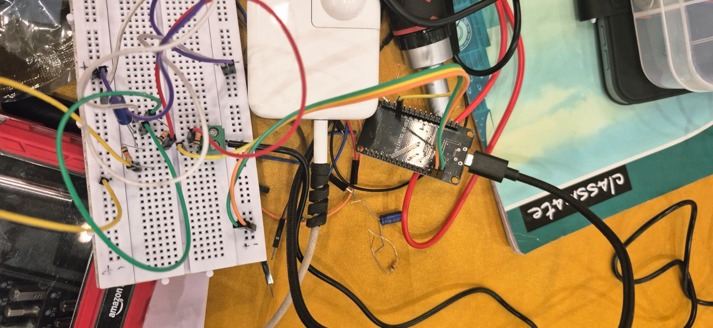
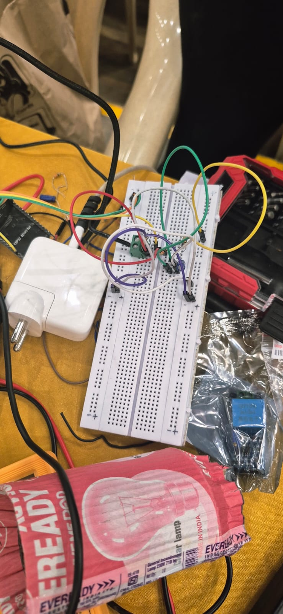
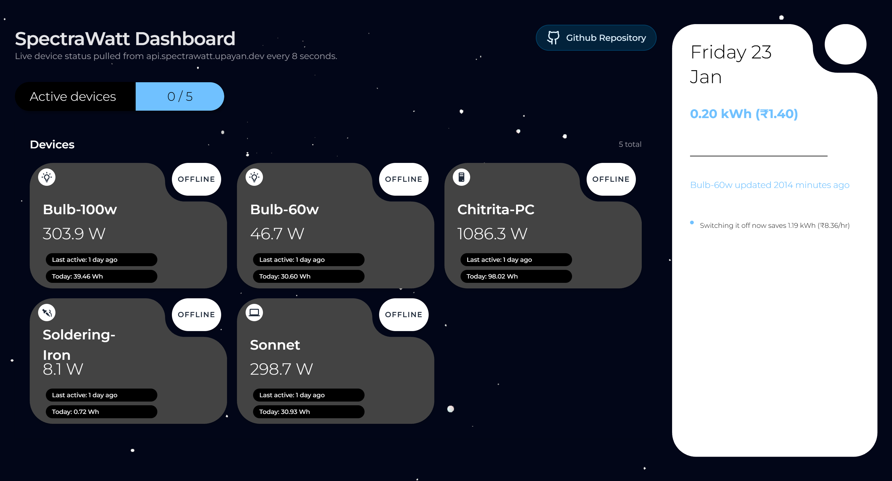

<div align="center">

# SpectraWatt

### Real-Time Energy Monitoring & Non-Intrusive Load Monitoring System

[](LICENSE)
[](https://api.spectrawatt.upayan.dev/api/data)
[](https://deepwiki.com/upayanmazumder/spectrawatt)

_An intelligent IoT-based energy monitoring solution combining hardware sensors, real-time data processing, and machine learning for device-level energy consumption analysis._

[Live Demo](https://api.spectrawatt.upayan.dev/api/data) • [Documentation](https://deepwiki.com/upayanmazumder/spectrawatt) • [Presentation](https://docs.google.com/presentation/d/1PXa_zHMbQIvO6-csMdzYiD67MFR_lH8S/edit?usp=sharing&ouid=100727951744327269861&rtpof=true&sd=true) • [Design](https://www.figma.com/design/z0dRciUB6ppUis6WrJowN9/Spectrawatt?node-id=0-1&t=odA6VwbAMmuJMBZr-1)

</div>

---

## Table of Contents

- [Overview](#overview)
- [Key Features](#key-features)
- [System Architecture](#system-architecture)
- [Project Gallery](#project-gallery)
- [Technology Stack](#technology-stack)
- [Components](#components)
- [Getting Started](#getting-started)
- [Deployment](#deployment)
- [Documentation](#documentation)
- [Contributing](#contributing)
- [License](#license)
- [Team](#team)

---

## Overview

**SpectraWatt** is an advanced energy monitoring ecosystem that leverages Internet of Things (IoT) technology, cloud computing, and machine learning to provide real-time insights into electrical energy consumption. The system enables users to monitor individual appliance usage, detect anomalies, and optimize energy consumption through an intuitive web dashboard.

### Core Capabilities

- **Real-Time Monitoring**: Track voltage, current, power, and energy consumption with sub-second latency
- **Device Classification**: AI-powered Non-Intrusive Load Monitoring (NILM) identifies individual appliances
- **Historical Analytics**: Comprehensive data storage and visualization of consumption patterns
- **Scalable Architecture**: Containerized microservices deployable on cloud infrastructure
- **Cross-Platform Access**: Responsive web interface accessible from any device

---

## Key Features

### Hardware Integration

- ESP32-based energy monitoring using EmonLib
- Current transformers for non-invasive current measurement
- Real-time voltage and current RMS calculations
- Batched data transmission with configurable sampling rates

### Backend Services

- **RESTful API** built with Go (Golang) for high-performance data ingestion
- **MongoDB** persistence layer for reliable time-series data storage
- Device-specific data retrieval and aggregation
- Health monitoring and automatic indexing
- CORS-enabled for web client integration

### Machine Learning Pipeline

- **LSTM Neural Networks** for appliance fingerprinting
- Event-based NILM with delta power analysis
- Clustering algorithms for unsupervised device detection
- Live classification with windowed feature extraction

### Frontend Dashboard

- Next.js-powered responsive web application
- Real-time energy usage visualization
- Active device monitoring
- Cost estimation and analytics
- Particle effects and modern UI/UX design

---

## System Architecture

```
┌─────────────────────────────────────────────────────────────┐
│                        SpectraWatt                           │
└─────────────────────────────────────────────────────────────┘
        │
        ├─── Hardware Layer
        │    └── ESP32 + Current Transformer + EmonLib
        │        └── WiFi → HTTPS
        │
        ├─── Backend Layer (Go API)
        │    ├── REST Endpoints (/api/data, /health)
        │    ├── MongoDB Persistence
        │    └── Deployed: api.spectrawatt.upayan.dev
        │
        ├─── ML Layer (Python + PyTorch)
        │    ├── NILM Event Detection
        │    ├── LSTM Device Classification
        │    ├── K-Means Clustering
        │    └── Live Monitoring Service
        │
        └─── Frontend Layer (Next.js)
             ├── Real-time Dashboard
             ├── Device Monitoring
             └── Energy Analytics
```

**Infrastructure**:

- Kubernetes orchestration (manifests in `/k8s`)
- Docker containerization for all services
- MongoDB Atlas for production database
- HTTPS/TLS encryption for data transmission

---

## Project Gallery

<div align="center">

### Hardware Setup

<table>
  <tr>
    <td width="33%"><br/><sub><b>Breadboard Setup - Front View</b></sub></td>
    <td width="33%"><br/><sub><b>Breadboard Setup - Wiring Detail</b></sub></td>
    <td width="33%"><br/><sub><b>Complete Electronics Assembly</b></sub></td>
  </tr>
</table>

### ESP32 Microcontroller

<table>
  <tr>
    <td width="50%"><br/><sub><b>ESP32 Development Board</b></sub></td>
    <td width="50%"><br/><sub><b>Testing Environment</b></sub></td>
  </tr>
</table>

### Dashboard Interface


<sub><b>Live Dashboard - Real-time energy monitoring interface</b></sub>

### Team

<table>
  <tr>
    <td width="50%"><br/><sub><b>Team IoTeehee</b></sub></td>
    <td width="50%"><br/><sub><b>Project Credentials</b></sub></td>
  </tr>
</table>

</div>

---

## Technology Stack

### Hardware

- **Microcontroller**: ESP32 (WiFi-enabled)
- **Sensors**: Current Transformer (CT), Voltage Divider
- **Library**: EmonLib (Energy Monitoring)
- **Communication**: WiFi, HTTPS

### Backend

- **Language**: Go 1.21+
- **Framework**: Gorilla Mux
- **Database**: MongoDB 7.0
- **Container**: Docker, Docker Compose
- **Deployment**: Kubernetes, Systemd

### Machine Learning

- **Framework**: PyTorch
- **Models**: LSTM, K-Means
- **Libraries**: NumPy, Pandas, scikit-learn
- **API**: FastAPI (for ML predictions)

### Frontend

- **Framework**: Next.js 15 (React 19)
- **Language**: TypeScript
- **Styling**: Tailwind CSS
- **HTTP Client**: Axios
- **Fonts**: Montserrat (Google Fonts)

### DevOps

- **Containerization**: Docker
- **Orchestration**: Kubernetes
- **CI/CD**: GitHub Actions (implied by container registry)
- **Version Control**: Git, GitHub

---

## Components

### 1. ESP32 Firmware ([`/esp-32`](esp-32))

Energy monitoring firmware that:

- Reads voltage and current using EmonLib
- Calculates power and cumulative energy (Wh)
- Batches readings for efficient transmission
- Sends HTTPS POST requests to backend API
- Integrates with Blynk for remote monitoring

**Key Files**:

- [`FeedDeviceData.ino`](esp-32/FeedDeviceData/FeedDeviceData.ino) - Main Arduino sketch

### 2. Backend API ([`/api`](api))

High-performance Go-based REST API:

- Receives energy data from ESP32 devices
- Stores time-series data in MongoDB
- Provides endpoints for data retrieval and aggregation
- Implements health checks and monitoring
- Deployed at [api.spectrawatt.upayan.dev](https://api.spectrawatt.upayan.dev/api/data)

**Docker Image**: [`ghcr.io/upayanmazumder/spectrawatt/api`](https://github.com/upayanmazumder/spectrawatt/pkgs/container/spectrawatt%2Fapi)

**Key Files**:

- [`main.go`](api/main.go) - API server implementation
- [`docker-compose.yml`](api/docker-compose.yml) - Container orchestration
- [`QUICKSTART.md`](api/QUICKSTART.md) - Setup guide

### 3. Machine Learning Engine ([`/ml`](ml))

PyTorch-based NILM system:

- **Training**: LSTM network for device classification
- **Prediction**: Real-time appliance identification
- **Live Monitoring**: Continuous classification loop
- **API Service**: FastAPI endpoint for predictions

**Docker Image**: [`ghcr.io/upayanmazumder/spectrawatt/ml`](https://github.com/upayanmazumder/spectrawatt/pkgs/container/spectrawatt%2Fml)

**Key Files**:

- [`model.py`](ml/src/model.py) - LSTM architecture
- [`train.py`](ml/src/train.py) - Model training
- [`predict_live.py`](ml/src/predict_live.py) - Live classification
- [`README_DOCKER.md`](ml/README_DOCKER.md) - Docker setup

### 4. Event-Based NILM ([`/AI_ML/NILM-Event-Based`](AI_ML/NILM-Event-Based))

Advanced analytics pipeline:

- Event detection from power deltas
- Clustering for unsupervised device discovery
- Energy consumption calculation per device
- Label assignment and state tracking

**Key Files**:

- [`event_detector.py`](AI_ML/NILM-Event-Based/src/event_detector.py) - Event detection
- [`clustering.py`](AI_ML/NILM-Event-Based/src/clustering.py) - K-Means clustering
- [`energy_calc.py`](AI_ML/NILM-Event-Based/src/energy_calc.py) - Energy analytics

### 5. Frontend Dashboard ([`/app`](app))

Modern Next.js web application:

- Real-time energy monitoring dashboard
- Live device status display
- Historical data visualization
- Responsive design for mobile and desktop

**Docker Image**: [`ghcr.io/upayanmazumder/spectrawatt/app`](https://github.com/upayanmazumder/spectrawatt/pkgs/container/spectrawatt%2Fapp)

**Key Files**:

- [`page.tsx`](app/src/app/page.tsx) - Main dashboard
- [`Sidebar.tsx`](app/src/components/Sidebar/Sidebar.tsx) - Energy stats sidebar
- [`api.ts`](app/src/components/Sidebar/lib/api.ts) - API integration

### 6. Kubernetes Deployment ([`/k8s`](k8s))

Production-ready Kubernetes manifests:

- API deployment with secrets and service
- ML service deployment
- Ingress configuration with TLS
- Namespace isolation

**Key Files**:

- [`ingress.yaml`](k8s/ingress.yaml) - Traffic routing
- [`api/deployment.yaml`](k8s/api/deployment.yaml) - API pods
- [`ml/deployment.yaml`](k8s/ml/deployment.yaml) - ML pods

---

## Getting Started

### Prerequisites

- **Hardware**: ESP32, Current Transformer, resistors, breadboard
- **Software**:
  - Go 1.21+ (for API)
  - Python 3.9+ (for ML)
  - Node.js 18+ & pnpm (for frontend)
  - Docker & Docker Compose (recommended)
  - MongoDB 7.0+ (or use Docker)

### Quick Setup with Docker

1. **Clone the repository**:

   ```bash
   git clone https://github.com/upayanmazumder/spectrawatt.git
   cd spectrawatt
   ```

2. **Start the backend API**:

   ```bash
   cd api
   docker-compose up -d
   ```

   API will be available at `http://localhost:8080`

3. **Start the ML service**:

   ```bash
   cd ../ml
   docker-compose up -d
   ```

4. **Start the frontend**:

   ```bash
   cd ../app
   pnpm install
   pnpm dev
   ```

   Dashboard will be available at `http://localhost:3000`

5. **Flash ESP32 firmware**:
   - Open [`esp-32/FeedDeviceData/FeedDeviceData.ino`](esp-32/FeedDeviceData/FeedDeviceData.ino) in Arduino IDE
   - Update WiFi credentials and API endpoint
   - Upload to ESP32

### Manual Setup

Refer to component-specific documentation:

- [API Quick Start Guide](api/QUICKSTART.md)
- [ML Docker Setup](ml/README_DOCKER.md)
- [API README](api/README.md)

---

## Deployment

### Production API

- **URL**: [https://api.spectrawatt.upayan.dev/api/data](https://api.spectrawatt.upayan.dev/api/data)
- **Health Check**: [https://api.spectrawatt.upayan.dev/health](https://api.spectrawatt.upayan.dev/health)
- **Infrastructure**: Kubernetes cluster with MongoDB Atlas

### Container Registry

All services are containerized and available on GitHub Container Registry:

| Service  | Image                                                                                                                      | Description        |
| -------- | -------------------------------------------------------------------------------------------------------------------------- | ------------------ |
| API      | [`ghcr.io/upayanmazumder/spectrawatt/api`](https://github.com/upayanmazumder/spectrawatt/pkgs/container/spectrawatt%2Fapi) | Go backend API     |
| Frontend | [`ghcr.io/upayanmazumder/spectrawatt/app`](https://github.com/upayanmazumder/spectrawatt/pkgs/container/spectrawatt%2Fapp) | Next.js dashboard  |
| ML       | [`ghcr.io/upayanmazumder/spectrawatt/ml`](https://github.com/upayanmazumder/spectrawatt/pkgs/container/spectrawatt%2Fml)   | PyTorch ML service |

### Deployment Options

1. **Kubernetes**: Use manifests in [`/k8s`](k8s) directory
2. **Docker Compose**: Available in each component directory
3. **Systemd Service**: Use [`deploy.sh`](api/deploy.sh) for Linux servers

---

## Documentation

- **Project Wiki**: [DeepWiki Documentation](https://deepwiki.com/upayanmazumder/spectrawatt)
- **API Documentation**: [API README](api/README.md) | [MongoDB Setup](api/MONGODB.md)
- **ML Documentation**: [ML Docker Guide](ml/README_DOCKER.md)
- **Presentation**: [Google Slides](https://docs.google.com/presentation/d/1PXa_zHMbQIvO6-csMdzYiD67MFR_lH8S/edit?usp=sharing&ouid=100727951744327269861&rtpof=true&sd=true)
- **Design System**: [Figma Design Files](https://www.figma.com/design/z0dRciUB6ppUis6WrJowN9/Spectrawatt?node-id=0-1&t=odA6VwbAMmuJMBZr-1)
- **Kubernetes Guide**: [K8s Deployment](api/KUBERNETES.md)

---

## Contributing

Contributions are welcome! Please follow these guidelines:

1. Fork the repository
2. Create a feature branch (`git checkout -b feature/AmazingFeature`)
3. Commit your changes (`git commit -m 'Add some AmazingFeature'`)
4. Push to the branch (`git push origin feature/AmazingFeature`)
5. Open a Pull Request

Please ensure your code follows the existing style and includes appropriate tests.

---

## License

This project is licensed under the MIT License - see the [LICENSE](LICENSE) file for details.

---

## Team

**Team IoTeehee**

- **[Upayan Mazumder](https://www.linkedin.com/in/upayanmazumder/)**
- **[Aditya Rohilla](https://www.linkedin.com/in/aditya-rohilla-2345362b3/)**
- **[Shrish Makwana](https://www.linkedin.com/in/shrish-makwana/)**
- **[Chitrita Gahlot](https://www.linkedin.com/in/chitritagahlot/)**

---

<div align="center">

**[Live API](https://api.spectrawatt.upayan.dev/api/data)** • **[Documentation](https://deepwiki.com/upayanmazumder/spectrawatt)** • **[Design](https://www.figma.com/design/z0dRciUB6ppUis6WrJowN9/Spectrawatt)**

</div>
